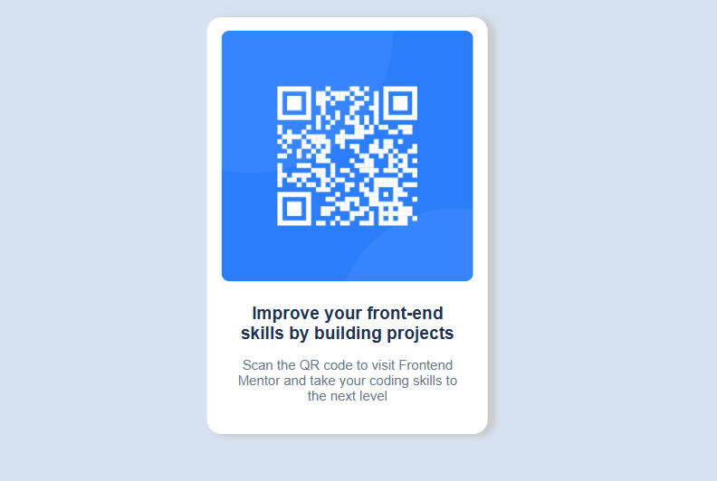

# Frontend Mentor - QR code component solution

This is a solution to the [QR code component challenge on Frontend Mentor](https://www.frontendmentor.io/challenges/qr-code-component-iux_sIO_H). Frontend Mentor challenges help you improve your coding skills by building realistic projects. 

## Table of contents

- [Overview](#overview)
  - [Screenshot](#screenshot)
- [My process](#my-process)
  - [Built with](#built-with)
  - [What I learned](#what-i-learned)
  - [Continued development](#continued-development)
  - [Useful resources](#useful-resources)
- [Author](#author)
- [Acknowledgments](#acknowledgments)


## Overview


#### Screenshot



## My process

- It helps you to go back to the basics of using divs, css specificity, flexbox, custom color names, integrating google fonts and keen attention to details. 👁️‍🗨️👁️

- The project was fun to code as it took an hour tops to complete.

- You can look at the code and review if neccessary. Kindly rate my work.😁😁

### Built with

- Semantic HTML5 markup
- CSS custom properties
- Flexbox
- Mobile-first workflow
- For css styles 


### What I learned


```html
<div class="card">
      <div class="card__image">
        
      </div>
      <div class="card__info">
        <div class="card__heading">
          <h1>Improve your front-end skills by building projects</h1>
        </div>
        <div class="card__paragraph">
          <p>
            Scan the QR code to visit Frontend Mentor and take your coding
            skills to the next level
          </p>
        </div>
      </div>
```
```css

.card {
  display: flex;
  flex-direction: column;
  align-items: center;
  text-align: center;
  width: 26rem;
  border-radius: 1.5rem;
  background-color: var(--color-white);
  color: var(--color-slate-300);
  padding: 22px 25px 10px 25px;
  box-shadow: 10px 2px 10px 2px rgb(202, 202, 202);
}

```


## Author

- Website - [Jude Nwadiogor](https://judesportfolio.netlify.app)
- Frontend Mentor - [@judexfrayo](https://www.frontendmentor.io/profile/judexfrayo)
- Twitter - [@judexfrayo](https://www.twitter.com/judexfrayo)


## Acknowledgments

I want to appreciate frontend mentor for their frontend code challenges and @codercoder, she helped me understand css in generally. It was great while it lasted. Unto the next project! 🚀

